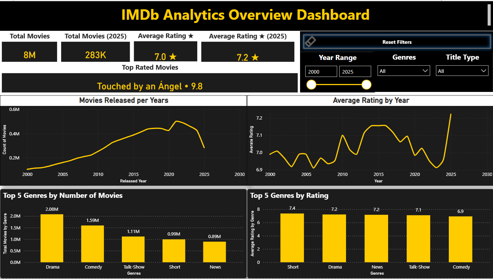
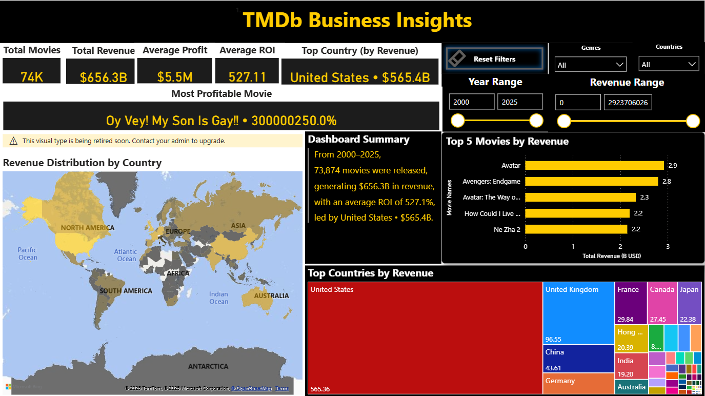

# 🎬 IMDb–TMDb Data Pipeline & Business Insights Dashboard

A complete **data engineering + analytics** project integrating **IMDb datasets** with **TMDb API**
to build automated (not yet) ETL pipelines and interactive business dashboards in **Power BI**.

---

## 🚀 Overview

This project aims to build an automated **IMDb data pipeline**, enrich it with **The Movie Database (TMDb) API**, and visualize **key business insights** such as:

- Total revenue & ROI  
- Top movies by revenue & rating  
- Market performance by country  
- Genre-level profitability & rating trends  

---

## 🧱 Architecture
```
IMDb (TSV Files)  
↓  [download_imdb.py]  
Staging Schema (PostgreSQL)  
↓  [load_staging.py]  
Core Schema (PostgreSQL)  
↓  [build_core.sql → swap_core.sql]  
TMDb Enrichment (API)  
↓  [enrich_tmdb.py]  
Power BI Dashboard (TMDb Business Insights)
```
✅ Containerized with Docker (PostgreSQL + pgAdmin)  

---

## 🗂️ Folder Structure
```
IMDB/  
│  
├── data/                         # Raw & processed datasets (not commited) 
│   ├── raw/                      # Original IMDb .tsv.gz files  
│   ├── unpacked/                 # Uncompressed IMDb (full)  
│   ├── unpacked_slim/            # Filtered data (2000–2025, numVotes ≥ 1000)  
│   └── enrich_tmdb_top100/     # TMDb-enriched test dataset (Top 100 movies)  
│  
├── docker/  
│   └── docker-compose.yml        # PostgreSQL + pgAdmin config  
│  
│ 
├── scripts/                      # ETL + API + automation  
│   ├── download_imdb.py  
│   ├── preprocess_slim.py  
│   ├── load_staging.py  
│   ├── build_core.sql  
│   ├── swap_core.sql  
│   ├── enrich_tmdb.py  
│  
├── sql/  
│   ├── init/                     # Create schemas  
│   │   └── 00_create_schema.sql  
│   ├── staging/                  # Staging tables  
│   │   └── 01_staging_tables.sql  
│   └── core/                     # Core + enriched tables  
│       ├── 02_core_tables.sql  
│       └── 03_tmdb_movies.sql  
│  
├── IMDb_quick_peek.ipynb         # Jupyter notebook for previewing data  
├── .env                          # DB credentials + API Key (not committed)  
└── .gitignore  
```
---

## ⚙️ Setup & Run

### 1️⃣ Create `.env` file
```bash
DB_HOST=localhost  
DB_PORT=5432  
DB_USER=your_username  
DB_PASSWORD=your_password  
DB_NAME=imdb  
TMDB_API_KEY=your_tmdb_key  
```
### 2️⃣ Start PostgreSQL & pgAdmin (Docker)
```bash
docker compose up -d
```
### 3️⃣ Run IMDb Pipeline
```bash
# Step 1 – Download & filter IMDb  
python scripts/download_imdb.py  
python scripts/preprocess_slim.py  
```
```bash
# Step 2 – Load to DB  
python scripts/load_staging.py  
docker exec -it imdb_pg psql -U imdb_user -d imdb -f /scripts/build_core.sql  
docker exec -it imdb_pg psql -U imdb_user -d imdb -f /scripts/swap_core.sql  
```
```bash
# Step 3 – Enrich with TMDb data  
python scripts/enrich_tmdb.py  
```

### 4️⃣ Load TMDb-enriched dataset into DB
```bash
docker exec -it imdb_pg psql -U imdb_user -d imdb -f /sql/core/03_tmdb_movies.sql  
\COPY imdb_ext.tmdb_movies FROM '/data/tmdb/tmdb_movies.csv' CSV HEADER;
```
### 5️⃣ Connect to Power BI

**Database:** PostgreSQL (`imdb`)  

| Schema    | Table |
|-----------|--------|
| imdb      | title_basics |
| imdb      | title_ratings |
| imdb_ext  | tmdb_movies |
| imdb_ext  | country_mapping |
| imdb_ext  | tmdb_genre_unique |

---

## 📊 Power BI Dashboard (Tabs)

### 🟡 Tab 1 – IMDb Overview

- Total Movies, AVG Rating  
- Movies Released per Year  
- Average Rating per Year  
- Top Genres by Count & Rating  
- Filters: Year, Genre, Title Type  

### 🔵 Tab 2 – TMDb Business Insights

✅ KPIs: Total Movies, Total Revenue, Avg Profit, Avg ROI, Most Profitable Movie  
✅ Map: Revenue by Country  

| Chart | Description |
|-------|-------------|
| Top 5 Movies by Revenue | Horizontal bar |
| Tree Map | Top Revenue by Country |

✅ Dynamic Summary Example using Multi-row card and 5 measures:  
“From 2000–2025, **73,874** movies were released, generating **$656.3B** in revenue, with an average ROI of **527.1%**, led by United States **$565.4B**.”

---

## 🧑‍💻 Author

**Hoàng Trung Nam**  
Data Science & Analytics | IMDb–TMDb Pipeline Project  
 
🛠️ Tools: Python, PostgreSQL, Power BI, Docker, TMDb API